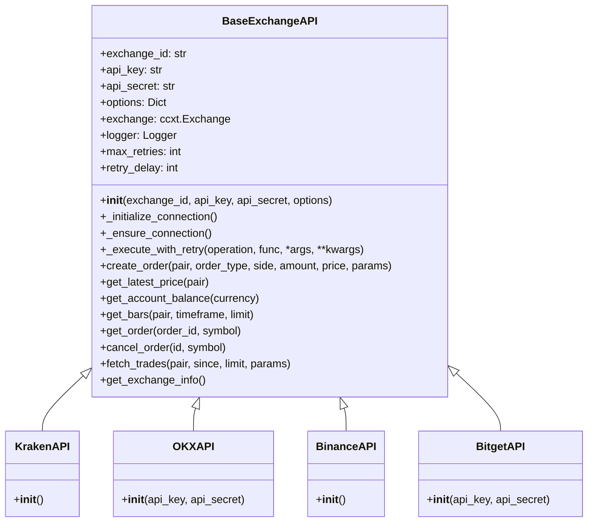

# Módulo Exchange APIs

## Descripción General

El módulo `exchange_apis.py` proporciona una interfaz unificada para interactuar con diferentes exchanges de criptomonedas a través de la biblioteca CCXT. Este módulo es fundamental para el sistema de trading, ya que maneja todas las comunicaciones con los exchanges, incluyendo la creación de órdenes, la obtención de precios y la gestión de balances.

## Estructura del Módulo

El módulo está organizado en una clase base `BaseExchangeAPI` que implementa la funcionalidad común, y varias clases específicas para cada exchange soportado (Binance, Kraken, OKX, Bitget).



## Características Principales

### 1. Gestión de Conexiones

El módulo implementa una gestión eficiente de conexiones a los exchanges:

- **Inicialización Única**: La conexión se establece una sola vez durante la inicialización de la instancia.
- **Reconexión Automática**: Si la conexión se pierde, el método `_ensure_connection()` la restablece automáticamente.
- **Manejo de Credenciales**: Las credenciales de API se obtienen de variables de entorno, lo que mejora la seguridad.

### 2. Manejo de Errores y Reintentos

El sistema implementa un robusto mecanismo de manejo de errores:

- **Reintentos Automáticos**: Las operaciones que fallan debido a errores de red o del exchange se reintentan automáticamente.
- **Logging Detallado**: Todos los errores y operaciones se registran con información detallada.
- **Excepciones Específicas**: Las excepciones se manejan de manera específica según su tipo, con diferentes estrategias para errores de red, errores del exchange y otros tipos de errores.

### 3. Operaciones de Trading

El módulo proporciona métodos para todas las operaciones comunes de trading:

- **Creación de Órdenes**: Órdenes de mercado, límite, stop loss y take profit.
- **Consulta de Precios**: Obtención de precios actuales y datos históricos.
- **Gestión de Balances**: Consulta de balances de cuenta.
- **Gestión de Órdenes**: Consulta y cancelación de órdenes existentes.

## Métodos Principales

### BaseExchangeAPI

#### Inicialización y Conexión

- **`__init__(exchange_id, api_key, api_secret, options)`**: Inicializa la instancia y establece la conexión con el exchange.
- **`_initialize_connection()`**: Establece la conexión con el exchange utilizando las credenciales proporcionadas.
- **`_ensure_connection()`**: Asegura que la conexión está establecida, reconectando si es necesario.

#### Manejo de Errores

- **`_execute_with_retry(operation, func, *args, **kwargs)`**: Ejecuta una operación con reintentos automáticos en caso de error.

#### Operaciones de Trading

- **`create_order(pair, order_type, side, amount, price, params={})`**: Crea una nueva orden en el exchange.
- **`get_latest_price(pair)`**: Obtiene el precio más reciente para un par de trading.
- **`get_account_balance(currency)`**: Obtiene el balance de una moneda específica.
- **`get_bars(pair, timeframe, limit)`**: Obtiene barras OHLCV (Open, High, Low, Close, Volume) para un par de trading.
- **`get_order(order_id, symbol='')`**: Obtiene detalles de una orden específica.
- **`cancel_order(id, symbol)`**: Cancela una orden existente.
- **`fetch_trades(pair, since=None, limit=None, params={})`**: Obtiene operaciones recientes para un par de trading.
- **`get_exchange_info()`**: Obtiene información sobre el exchange.

### Clases Específicas de Exchange

Cada clase específica de exchange (`KrakenAPI`, `OKXAPI`, `BinanceAPI`, `BitgetAPI`) hereda de `BaseExchangeAPI` y proporciona la configuración específica para ese exchange.

## Uso del Módulo

### Ejemplo de Uso Básico

```python
# Crear una instancia de la API de Binance
api = BinanceAPI()

# Obtener el precio actual de BTC/USDT
price = api.get_latest_price('BTC/USDT')
print(f"Precio actual de BTC/USDT: {price}")

# Obtener el balance de BTC
balance = api.get_account_balance('BTC')
print(f"Balance de BTC: {balance}")

# Crear una orden de compra de mercado
order = api.create_order('BTC/USDT', 'market', 'buy', 0.001, price)
print(f"Orden creada: {order['id']}")
```

### Uso con el Módulo Trader

El módulo `exchange_apis.py` se utiliza principalmente a través del módulo `trader.py`, que actúa como un orquestador entre las estrategias de trading y las APIs de exchange:

```python
from trader import Trader
from strategies import MultiMovingAverageStrategy
from exchange_apis import BinanceAPI

# Crear una instancia de la estrategia
strategy = MultiMovingAverageStrategy(...)

# Crear una instancia de la API de exchange
exchange_api = BinanceAPI()

# Crear una instancia del Trader
trader = Trader(strategy, exchange_api, 'BTC/USDT')

# Ejecutar la estrategia
trader.execute_strategy(market_data, memory)
```

## Consideraciones de Seguridad

- **Credenciales de API**: Las credenciales de API se obtienen de variables de entorno, lo que evita hardcodearlas en el código.
- **Validación de Balances**: El módulo `trader.py` valida que haya suficiente balance antes de ejecutar órdenes, pero es responsabilidad del usuario asegurarse de que las estrategias no generen órdenes que excedan los balances disponibles.

## Pruebas

El módulo cuenta con pruebas unitarias completas en `tests/test_exchange_apis.py` que cubren:

- Inicialización y conexión
- Manejo de errores y reintentos
- Todas las operaciones de trading
- Clases específicas de exchange

## Mejoras Futuras

1. **WebSockets**: Implementar soporte para WebSockets para datos en tiempo real.
2. **Más Exchanges**: Añadir soporte para más exchanges.
3. **Caché de Datos**: Implementar un sistema de caché para reducir el número de llamadas a la API.
4. **Rate Limiting Avanzado**: Mejorar el sistema de rate limiting para adaptarse dinámicamente a los límites de cada exchange.
5. **Simulación**: Añadir un modo de simulación para pruebas sin interactuar con exchanges reales.
