# Progress: Trading Bot

## Lo que Funciona

### Núcleo del Sistema
- ✅ Estructura modular con separación clara de responsabilidades
- ✅ Definiciones de tipos de datos fundamentales (Order, Memory, MarketData)
- ✅ Interfaz unificada para diferentes exchanges de criptomonedas
- ✅ Ejecución básica de órdenes de mercado (compra/venta)
- ✅ Implementación de órdenes avanzadas (límite, stop loss, take profit) en el módulo Trader
- ✅ Sistema de logging detallado para los módulos Trader y Exchange APIs
- ✅ Manejo robusto de errores y validación de balances en el módulo Trader
- ✅ Sistema de reintentos automáticos para operaciones de API en el módulo Exchange APIs
- ✅ Gestión eficiente de conexiones a exchanges (una sola conexión por instancia)

### Estrategias de Trading
- ✅ Arquitectura extensible para estrategias (clase base Strategy)
- ✅ Estrategia MultiMovingAverage implementada y funcional
- ✅ Estrategia AdaptiveMovingAverage implementada y funcional
- ✅ Estrategia MomentumRSI implementada y funcional
- ✅ Capacidad para cambiar entre fases de acumulación y distribución

### Indicadores Técnicos
- ✅ Medias móviles simples
- ✅ Bandas de Bollinger
- ✅ MACD (Moving Average Convergence Divergence)
- ✅ RSI (Relative Strength Index)
- ✅ Indicadores de volumen
- ✅ Indicadores de momentum (velocidad y aceleración)

### Sistema de Backtesting
- ✅ Simulación de estrategias con datos históricos
- ✅ Cálculo de métricas de rendimiento
- ✅ Backtesting múltiple para análisis estadístico
- ✅ Cálculo de intervalos de confianza y predicción
- ✅ Gestión de experimentos para optimización de parámetros

### Visualización
- ✅ Gráficos de precios e indicadores
- ✅ Visualización de resultados de backtesting
- ✅ Gráficos comparativos de experimentos

### Gestión de Datos
- ✅ Descarga de datos históricos de Coinex
- ✅ Descarga de datos históricos de Binance
- ✅ Procesamiento y normalización de datos
- ✅ Selección de segmentos de datos por duración y variación

### Despliegue
- ✅ Configuración Docker para despliegue consistente
- ✅ Gestión segura de credenciales a través de variables de entorno

## Lo que Falta por Construir

### Órdenes Avanzadas
- ✅ Implementación de órdenes límite
- ✅ Implementación de stop loss
- ✅ Implementación de take profit
- ✅ Gestión de órdenes pendientes (cancelación y consulta de estado)
- ❌ Verificación de compatibilidad con todos los exchanges soportados

### Gestión de Riesgos
- ❌ Límites de pérdidas automáticos
- ❌ Diversificación entre múltiples pares/estrategias
- ❌ Análisis de correlación entre activos

### Pruebas
- ✅ Pruebas unitarias completas para el módulo Trader
- ✅ Pruebas unitarias completas para el módulo Exchange APIs
- ❌ Pruebas unitarias para otros componentes
- ❌ Pruebas de integración
- ❌ Pruebas de rendimiento

### Monitoreo y Logging
- ✅ Sistema de logging detallado para los módulos Trader y Exchange APIs
- ❌ Sistema de logging para otros componentes
- ❌ Alertas para eventos críticos
- ❌ Dashboard para monitoreo en tiempo real

### Optimización
- ❌ Optimización automática de parámetros de estrategias
- ❌ Validación cruzada para evitar overfitting
- ❌ Backtesting con datos out-of-sample

### Interfaz de Usuario
- ❌ CLI mejorada para control y monitoreo
- ❌ API REST para acceso remoto
- ❌ Interfaz web para visualización y control

### Documentación
- ✅ Documentación detallada del módulo Trader
- ✅ Documentación detallada del módulo Exchange APIs
- ❌ Documentación de API completa para otros componentes
- ❌ Guías de usuario
- ❌ Ejemplos de uso

## Estado Actual

### Componentes Implementados
| Componente | Estado | Notas |
|------------|--------|-------|
| Núcleo del Sistema | 90% | Funcionalidad básica completa, órdenes avanzadas implementadas en Trader |
| Estrategias | 70% | Tres estrategias implementadas, pero pueden refinarse |
| Indicadores | 90% | Mayoría de indicadores comunes implementados |
| Backtesting | 85% | Sistema robusto, pero falta optimización automática |
| Visualización | 75% | Funcionalidad básica presente, falta dashboard interactivo |
| Gestión de Datos | 70% | Funciona, pero podría mejorarse con base de datos |
| Despliegue | 60% | Docker configurado, falta CI/CD y monitoreo |
| Pruebas | 40% | Pruebas completas para Trader y Exchange APIs, faltan para otros componentes |
| Documentación | 50% | Documentación mejorada para Trader y Exchange APIs, falta para otros componentes |

### Progreso por Módulo

```mermaid
graph TD
    subgraph "Progreso del Proyecto"
    A[Trader] -->|100%| B[Exchange APIs]
    B -->|100%| C[Strategies]
    C -->|30%| D[Backtesting]
    D -->|30%| E[Data Manager]
    E -->|30%| F[Indicators]
    F -->|30%| G[Drawer]
    G -->|30%| H[Integración]
    H -->|20%| I[Despliegue]
    I -->|10%| J[Completado]
    
    style A fill:#4CAF50,stroke:#388E3C,color:white
    style B fill:#4CAF50,stroke:#388E3C,color:white
    style C fill:#FFC107,stroke:#FFA000,color:black
    style D fill:#FFC107,stroke:#FFA000,color:black
    style E fill:#FFC107,stroke:#FFA000,color:black
    style F fill:#FFC107,stroke:#FFA000,color:black
    style G fill:#FFC107,stroke:#FFA000,color:black
    end
```

## Problemas Conocidos

### Bugs y Limitaciones

1. **Órdenes Avanzadas Implementadas Parcialmente**
   - Las funciones para órdenes límite, stop loss y take profit están implementadas en el módulo Trader.
   - Pendiente verificar compatibilidad con todos los exchanges soportados.
   - Impacto: Posibles diferencias en el comportamiento según el exchange.

2. **Gestión de Errores Mejorada Parcialmente**
   - El manejo de errores de API de exchanges ha sido mejorado en los módulos Trader y Exchange APIs.
   - Pendiente extender estas mejoras a otros componentes.
   - Impacto: Robustez desigual en diferentes partes del sistema.

3. **Pruebas Insuficientes**
   - Cobertura de pruebas limitada.
   - Impacto: Mayor riesgo de bugs no detectados.

4. **Almacenamiento de Datos en CSV**
   - Los datos históricos se almacenan en archivos CSV.
   - Impacto: Limitaciones en escalabilidad y rendimiento para grandes volúmenes de datos.

5. **Documentación Interna Mejorada Parcialmente**
   - Comentarios y documentación en el código han sido mejorados en los módulos Trader y Exchange APIs.
   - Pendiente extender estas mejoras a otros componentes.
   - Impacto: Curva de aprendizaje desigual para diferentes partes del sistema.

### Deuda Técnica

1. **Validación de Datos Inconsistente**
   - Algunas partes del código utilizan validación estricta con pydantic/pandera, otras no.
   - Acción: Estandarizar la validación de datos en todo el proyecto.

2. **Hardcoding de Configuraciones**
   - Algunas configuraciones están hardcodeadas en lugar de externalizadas.
   - Acción: Mover todas las configuraciones a archivos de configuración o variables de entorno.

3. **Duplicación en Procesamiento de Datos**
   - Existe cierta duplicación en el procesamiento de datos históricos.
   - Acción: Refactorizar para centralizar el procesamiento de datos.

4. **Acoplamiento entre Componentes**
   - Algunos componentes tienen mayor acoplamiento del deseado.
   - Acción: Revisar y mejorar la separación de responsabilidades.

5. **Logging Inconsistente**
   - El logging no sigue un patrón consistente en todo el proyecto.
   - Acción: Implementar un sistema de logging unificado.

## Próximos Hitos

### Corto Plazo (1-2 Semanas)
- [x] Completar la documentación interna del código para el módulo Trader
- [x] Implementar pruebas unitarias para el módulo Trader
- [x] Documentar y mejorar el módulo Exchange APIs
- [x] Implementar pruebas unitarias para el módulo Exchange APIs
- [ ] Seleccionar el siguiente módulo a mejorar (Strategies o Backtesting)
- [ ] Documentar y mejorar el módulo seleccionado
- [ ] Implementar pruebas unitarias para el módulo seleccionado

### Medio Plazo (1-2 Meses)
- [x] Implementar órdenes límite, stop loss y take profit
- [x] Mejorar la gestión de errores y robustez en los módulos Trader y Exchange APIs
- [x] Desarrollar un sistema de logging detallado para los módulos Trader y Exchange APIs
- [ ] Completar el ciclo de mejora para todos los módulos principales:
  - [x] Trader
  - [x] Exchange APIs
  - [ ] Strategies
  - [ ] Backtesting
  - [ ] Data Manager
  - [ ] Indicators
  - [ ] Drawer (Visualización)
- [ ] Considerar migración a base de datos para datos históricos

### Largo Plazo (3+ Meses)
- [ ] Desarrollar una interfaz web para monitoreo y control
- [ ] Implementar optimización automática de parámetros
- [ ] Expandir a más exchanges y pares de trading
- [ ] Considerar la integración con modelos de aprendizaje automático
