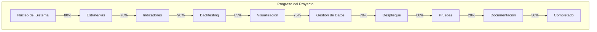

# Progress: Trading Bot

## Lo que Funciona

### Núcleo del Sistema
- ✅ Estructura modular con separación clara de responsabilidades
- ✅ Definiciones de tipos de datos fundamentales (Order, Memory, MarketData)
- ✅ Interfaz unificada para diferentes exchanges de criptomonedas
- ✅ Ejecución básica de órdenes de mercado (compra/venta)

### Estrategias de Trading
- ✅ Arquitectura extensible para estrategias (clase base Strategy)
- ✅ Estrategia MultiMovingAverage implementada y funcional
- ✅ Estrategia AdaptiveMovingAverage implementada y funcional
- ✅ Estrategia MomentumRSI implementada y funcional
- ✅ Capacidad para cambiar entre fases de acumulación y distribución

### Indicadores Técnicos
- ✅ Medias móviles simples
- ✅ Bandas de Bollinger
- ✅ MACD (Moving Average Convergence Divergence)
- ✅ RSI (Relative Strength Index)
- ✅ Indicadores de volumen
- ✅ Indicadores de momentum (velocidad y aceleración)

### Sistema de Backtesting
- ✅ Simulación de estrategias con datos históricos
- ✅ Cálculo de métricas de rendimiento
- ✅ Backtesting múltiple para análisis estadístico
- ✅ Cálculo de intervalos de confianza y predicción
- ✅ Gestión de experimentos para optimización de parámetros

### Visualización
- ✅ Gráficos de precios e indicadores
- ✅ Visualización de resultados de backtesting
- ✅ Gráficos comparativos de experimentos

### Gestión de Datos
- ✅ Descarga de datos históricos de Coinex
- ✅ Descarga de datos históricos de Binance
- ✅ Procesamiento y normalización de datos
- ✅ Selección de segmentos de datos por duración y variación

### Despliegue
- ✅ Configuración Docker para despliegue consistente
- ✅ Gestión segura de credenciales a través de variables de entorno

## Lo que Falta por Construir

### Órdenes Avanzadas
- ❌ Implementación de órdenes límite
- ❌ Implementación de stop loss
- ❌ Implementación de take profit
- ❌ Gestión de órdenes pendientes

### Gestión de Riesgos
- ❌ Límites de pérdidas automáticos
- ❌ Diversificación entre múltiples pares/estrategias
- ❌ Análisis de correlación entre activos

### Pruebas
- ❌ Pruebas unitarias completas para todos los componentes
- ❌ Pruebas de integración
- ❌ Pruebas de rendimiento

### Monitoreo y Logging
- ❌ Sistema de logging detallado
- ❌ Alertas para eventos críticos
- ❌ Dashboard para monitoreo en tiempo real

### Optimización
- ❌ Optimización automática de parámetros de estrategias
- ❌ Validación cruzada para evitar overfitting
- ❌ Backtesting con datos out-of-sample

### Interfaz de Usuario
- ❌ CLI mejorada para control y monitoreo
- ❌ API REST para acceso remoto
- ❌ Interfaz web para visualización y control

### Documentación
- ❌ Documentación de API completa
- ❌ Guías de usuario
- ❌ Ejemplos de uso

## Estado Actual

### Componentes Implementados
| Componente | Estado | Notas |
|------------|--------|-------|
| Núcleo del Sistema | 80% | Funcionalidad básica completa, faltan órdenes avanzadas |
| Estrategias | 70% | Tres estrategias implementadas, pero pueden refinarse |
| Indicadores | 90% | Mayoría de indicadores comunes implementados |
| Backtesting | 85% | Sistema robusto, pero falta optimización automática |
| Visualización | 75% | Funcionalidad básica presente, falta dashboard interactivo |
| Gestión de Datos | 70% | Funciona, pero podría mejorarse con base de datos |
| Despliegue | 60% | Docker configurado, falta CI/CD y monitoreo |
| Pruebas | 20% | Pocas pruebas implementadas |
| Documentación | 30% | Documentación interna limitada, falta documentación de usuario |

### Progreso por Módulo

## Problemas Conocidos

### Bugs y Limitaciones

1. **Órdenes Avanzadas No Implementadas**
   - Las funciones para órdenes límite, stop loss y take profit están definidas pero no implementadas.
   - Impacto: Limita las estrategias a órdenes de mercado únicamente.

2. **Gestión de Errores Limitada**
   - El manejo de errores de API de exchanges es básico.
   - Impacto: Posibles interrupciones en la ejecución del bot ante fallos de API.

3. **Pruebas Insuficientes**
   - Cobertura de pruebas limitada.
   - Impacto: Mayor riesgo de bugs no detectados.

4. **Almacenamiento de Datos en CSV**
   - Los datos históricos se almacenan en archivos CSV.
   - Impacto: Limitaciones en escalabilidad y rendimiento para grandes volúmenes de datos.

5. **Documentación Interna Limitada**
   - Comentarios y documentación en el código son escasos.
   - Impacto: Curva de aprendizaje más pronunciada para nuevos desarrolladores.

### Deuda Técnica

1. **Validación de Datos Inconsistente**
   - Algunas partes del código utilizan validación estricta con pydantic/pandera, otras no.
   - Acción: Estandarizar la validación de datos en todo el proyecto.

2. **Hardcoding de Configuraciones**
   - Algunas configuraciones están hardcodeadas en lugar de externalizadas.
   - Acción: Mover todas las configuraciones a archivos de configuración o variables de entorno.

3. **Duplicación en Procesamiento de Datos**
   - Existe cierta duplicación en el procesamiento de datos históricos.
   - Acción: Refactorizar para centralizar el procesamiento de datos.

4. **Acoplamiento entre Componentes**
   - Algunos componentes tienen mayor acoplamiento del deseado.
   - Acción: Revisar y mejorar la separación de responsabilidades.

5. **Logging Inconsistente**
   - El logging no sigue un patrón consistente en todo el proyecto.
   - Acción: Implementar un sistema de logging unificado.

## Próximos Hitos

### Corto Plazo (1-2 Semanas)
- [ ] Completar la documentación interna del código
- [ ] Implementar pruebas unitarias básicas para componentes críticos
- [ ] Refinar las estrategias existentes basadas en backtesting extensivo

### Medio Plazo (1-2 Meses)
- [ ] Implementar órdenes límite, stop loss y take profit
- [ ] Mejorar la gestión de errores y robustez
- [ ] Desarrollar un sistema de logging detallado
- [ ] Considerar migración a base de datos para datos históricos

### Largo Plazo (3+ Meses)
- [ ] Desarrollar una interfaz web para monitoreo y control
- [ ] Implementar optimización automática de parámetros
- [ ] Expandir a más exchanges y pares de trading
- [ ] Considerar la integración con modelos de aprendizaje automático
