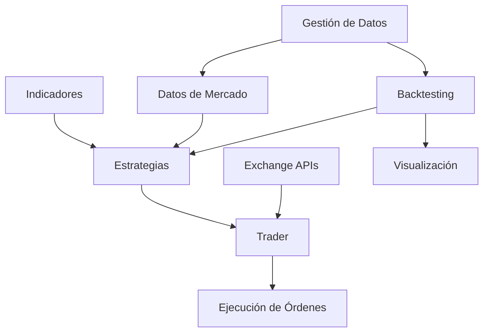
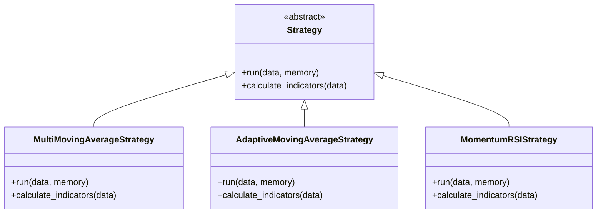
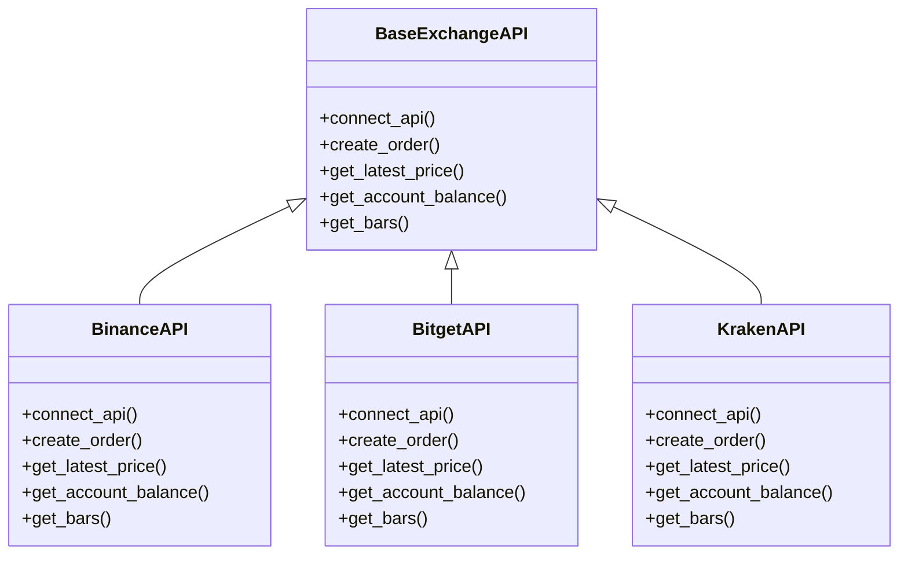
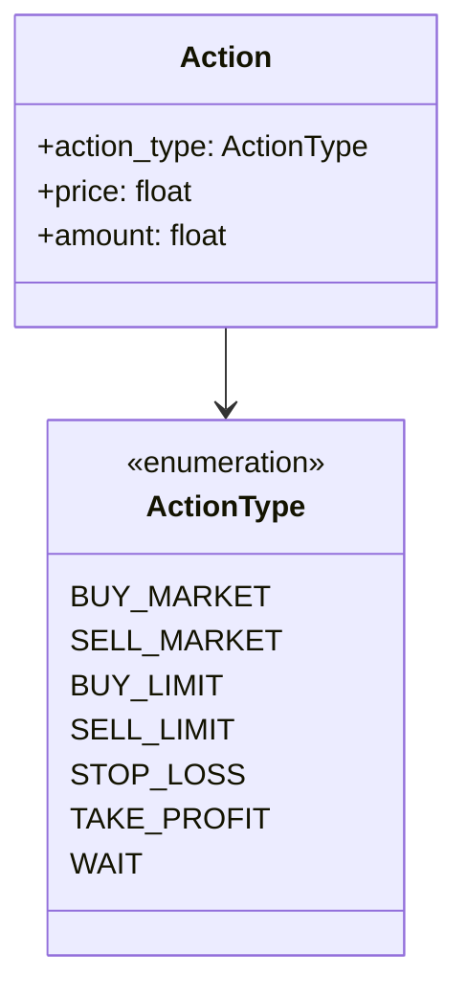
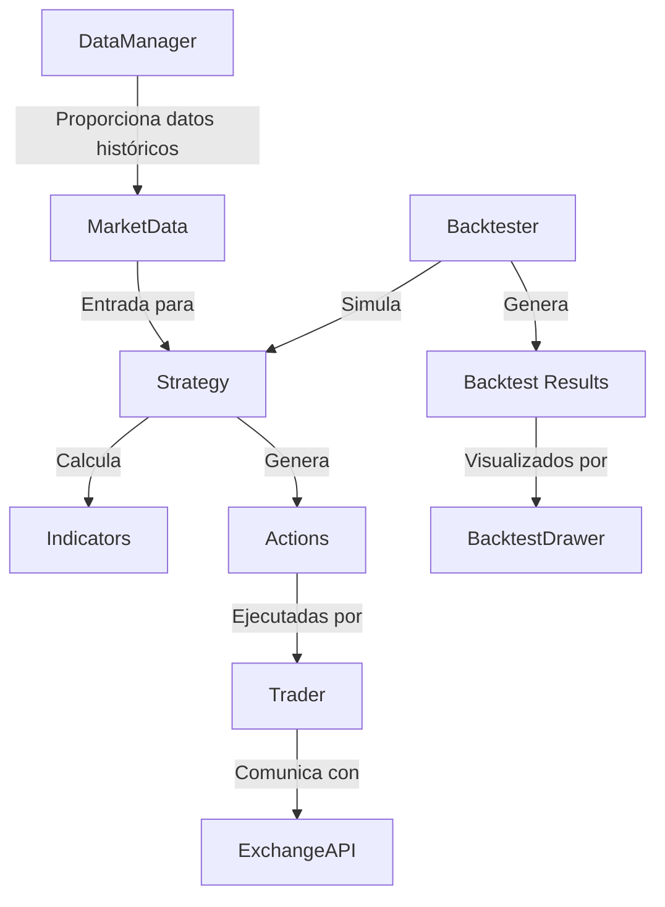
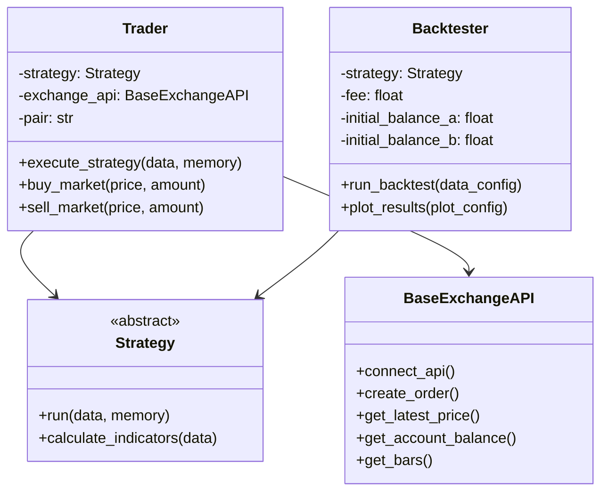

# System Patterns: Trading Bot

## Arquitectura del Sistema

El Trading Bot está estructurado siguiendo una arquitectura modular con componentes claramente separados por responsabilidades. La arquitectura general se puede visualizar de la siguiente manera:



### Componentes Principales

1. **Núcleo del Sistema**
   - `trader.py`: Coordina la ejecución de estrategias y la comunicación con exchanges
   - `definitions.py`: Define estructuras de datos fundamentales (Order, Memory, MarketData)
   - `exchange_apis.py`: Proporciona una interfaz unificada para interactuar con diferentes exchanges

2. **Estrategias de Trading**
   - `strategies/strategy.py`: Define la interfaz base para todas las estrategias
   - Implementaciones específicas: MultiMovingAverageStrategy, AdaptiveMovingAverageStrategy, etc.

3. **Indicadores Técnicos**
   - `indicators.py`: Implementa cálculos de indicadores técnicos (medias móviles, RSI, MACD, etc.)

4. **Sistema de Backtesting**
   - `backtesting/backtester.py`: Simula la ejecución de estrategias con datos históricos
   - `backtesting/multi_backtest.py`: Ejecuta múltiples backtests para análisis estadístico
   - `backtesting/experiments_manager.py`: Gestiona experimentos con diferentes configuraciones

5. **Visualización**
   - `drawer/backtest_drawer.py`: Visualiza resultados de backtesting
   - `drawer/indicator_drawer.py`: Visualiza indicadores técnicos

6. **Gestión de Datos**
   - `data_manager.py`: Gestiona la descarga y procesamiento de datos históricos

## Patrones de Diseño

El sistema implementa varios patrones de diseño para mejorar su modularidad, extensibilidad y mantenibilidad:

### 1. Patrón Strategy

El patrón Strategy se utiliza para encapsular diferentes algoritmos de trading, permitiendo que sean intercambiables:



### 2. Patrón Adapter

El patrón Adapter se utiliza en `exchange_apis.py` para proporcionar una interfaz unificada a diferentes APIs de exchanges:



### 3. Patrón Factory Method

El patrón Factory Method se utiliza implícitamente en el sistema de backtesting para crear instancias de estrategias:

```python
def run_experiment(self, strategy, strategy_config, ...):
    # Creación de la estrategia usando Factory Method
    backtester = Backtester(strategy=strategy(**strategy_config), ...)
```

### 4. Patrón Command

El patrón Command se utiliza para encapsular acciones de trading como objetos:



## Decisiones Técnicas Clave

### 1. Validación de Datos

El sistema utiliza `pydantic` y `pandera` para validación de datos:
- `pydantic` para validar objetos como `Order` y `Memory`
- `pandera` para validar DataFrames como `MarketData` y `Backtest`

Esto garantiza la integridad de los datos y facilita la detección temprana de errores.

### 2. Procesamiento Paralelo

El sistema utiliza `ProcessPoolExecutor` para ejecutar múltiples backtests en paralelo, mejorando significativamente el rendimiento:

```python
with ProcessPoolExecutor() as executor:
    futures = []
    for i in range(num_tests_per_strategy):
        future = executor.submit(backtester.run_backtest, data_config)
        futures.append((i, future))
```

### 3. Gestión de Credenciales

Las credenciales de API se gestionan a través de variables de entorno y el archivo `.env`, siguiendo las mejores prácticas de seguridad:

```python
load_dotenv()
exchange = getattr(ccxt, self.exchange_id)({
    'apiKey': os.getenv(self.api_key),
    'secret': os.getenv(self.api_secret),
    **self.options
})
```

### 4. Contenedorización

El sistema está diseñado para ser desplegado como un contenedor Docker, facilitando su ejecución en diferentes entornos:

```dockerfile
FROM python:3.10
WORKDIR /app
COPY requirements.txt .
RUN pip install -r requirements.txt
COPY . .
CMD ["python", "./bitget_bot.py"]
```

## Relaciones entre Componentes

### Flujo de Datos



### Jerarquía de Clases



## Extensibilidad

El sistema está diseñado para ser fácilmente extensible en varias dimensiones:

1. **Nuevas Estrategias**: Crear una nueva clase que herede de `Strategy` e implemente los métodos requeridos.

2. **Nuevos Exchanges**: Crear una nueva clase que herede de `BaseExchangeAPI` e implemente los métodos específicos del exchange.

3. **Nuevos Indicadores**: Añadir nuevos métodos estáticos a la clase `Indicators`.

4. **Nuevas Visualizaciones**: Extender las clases en el módulo `drawer` para añadir nuevos tipos de visualizaciones.

Esta arquitectura modular facilita la evolución del sistema sin necesidad de modificar su núcleo.
